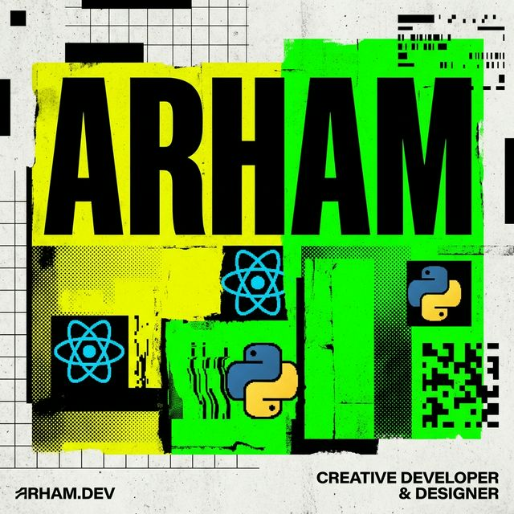

# ASHWAZ | Full Stack Brutalist Portfolio



A bold, unapologetically raw portfolio built with **NeoBrutalist design principles**. No minimalism. No boring grays. Just pure personality and code.

🔗 **[Live Demo](https://ashop31244.github.io/Portfolio/)**

---

## 🎨 Design Philosophy

This portfolio rejects the sanitized, corporate aesthetic that has overtaken modern web design. Instead, it embraces:

- **Thick black borders** on everything
- **Hard shadows** (no soft gradients here)
- **Vibrant neon colors** that actually mean something
- **Bold typography** with Space Grotesk & JetBrains Mono
- **Grid-based layouts** with visible structure
- **Raw, honest interactions** — hover effects that don't apologize

NeoBrutalism isn't just a trend — it's a statement. The web has become too polished. This portfolio brings personality back.

---

## ✨ Features

### 🎯 Core Functionality
- **Fully Responsive** — Mobile-first design that works everywhere
- **Custom Cursor** — Desktop users get a custom blend-mode cursor
- **Smooth Scroll Animations** — Intersection Observer-powered reveals
- **Progress Bar** — Real-time scroll progress indicator
- **Live GitHub Stats** — Auto-fetched via GitHub API
- **Email Contact Form** — Powered by EmailJS (no backend required)
- **Infinite Marquee** — Animated testimonial carousel

### 📊 Sections
1. **Hero** — Bold introduction with animated elements
2. **About** — Personal story with a grayscale-to-color photo hover
3. **Skills** — Interactive tech stack grid (11 technologies)
4. **Experience** — Timeline-based work history
5. **Coding Stats** — Live GitHub metrics with contribution graph
6. **Projects** — 5 featured projects with live links:
   - **Noirel-Perfume** (React + Django REST)
   - **Flipkart Clone** (Full-stack Django)
   - **Job Portal** (Django REST Framework)
   - **LeadSpot CRM** (Sales management system)
   - **TankMate** (Industrial capacity calculator)
7. **Testimonials** — Scrolling user reviews
8. **Contact** — EmailJS-powered form with success states

---

## 🛠️ Tech Stack

### Frontend
- **HTML5** — Semantic structure
- **CSS3** — Custom animations & brutalist styling
- **JavaScript (Vanilla)** — No frameworks for the main site
- **Tailwind CSS** (CDN) — Utility-first styling
- **Remix Icons** — Icon library

### Backend/Services
- **EmailJS** — Contact form handling (no server required)
- **GitHub API** — Live stats fetching

### Hosting
- **GitHub Pages** — Free, fast, reliable

---

## 🚀 Quick Start

### Prerequisites
None! This is a static site. Just a browser.

### Installation

```bash
# Clone the repo
git clone https://github.com/AshOP31244/Portfolio.git
cd Portfolio

# Open in browser
open index.html
```

Or use a local server:

```bash
# Python 3
python -m http.server 8000

# Node.js (http-server)
npx http-server

# VS Code Live Server extension
```

Then visit `http://localhost:8000`

---

## 📁 Project Structure

```
Portfolio/
├── index.html              # Main HTML file (all content in one page)
├── assets/
│   ├── images/             # Project screenshots, avatar, icons
│   │   ├── img.jpg         # Profile photo
│   │   ├── perfume1.png    # Noirel project
│   │   ├── Flipkart.png
│   │   ├── job-portal.png
│   │   ├── leadSpot.png
│   │   ├── tankmate.png
│   │   └── title_icon.png  # Favicon
│   └── resume/
│       └── ashwaz_final.pdf # Downloadable CV
└── README.md               # You are here
```

---

## 🎨 Color Palette

```css
--neo-yellow:  #FBFF48  /* Neon accents */
--neo-pink:    #FF70A6  /* Hover states */
--neo-blue:    #3B82F6  /* Links & CTAs */
--neo-green:   #33FF57  /* Success states */
--neo-purple:  #A855F7  /* Special highlights */
--neo-orange:  #FF9F1C  /* Warnings */
--neo-red:     #FF2A2A  /* Errors */
--neo-white:   #FFFDF5  /* Background */
--neo-black:   #121212  /* Text & borders */
```

---

## 📧 Contact Form Setup

The contact form uses **EmailJS** for submissions. To set up your own:

1. Create an account at [EmailJS](https://www.emailjs.com/)
2. Get your **Public Key** from the dashboard
3. Create an **Email Service** (e.g., Gmail)
4. Create an **Email Template** with these variables:
   - `{{from_name}}`
   - `{{from_email}}`
   - `{{message}}`
5. Replace in `index.html`:
   ```javascript
   emailjs.init("YOUR_PUBLIC_KEY");  // Line ~110
   emailjs.sendForm("service_xxxxx", "template_xxxxx", form)  // Line ~815
   ```

---

## 🔧 Customization Guide

### Change Personal Info
All content is in `index.html`. Search for:
- **Name**: `ASHWAZ` → Replace with your name
- **Email**: `ashwajpoojary2@gmail.com` → Your email
- **GitHub**: `AshOP31244` → Your GitHub username
- **Social Links**: Update Instagram, LinkedIn URLs

### Add/Remove Projects
Find the `<!-- ── PROJECTS ── -->` section. Each project follows this structure:

```html
<article class="reveal group bg-white border-4 border-black p-4 shadow-hard">
  <div class="bg-black border-2 border-black aspect-video relative overflow-hidden mb-6">
    
  </div>
  <div class="flex justify-between items-start">
    <div>
      <h3 class="text-4xl font-black uppercase mb-2 group-hover:text-neo-red">
        PROJECT NAME
      </h3>
      <p class="font-mono text-sm mb-4">Project description here</p>
      <div class="flex gap-2 font-mono text-xs font-bold flex-wrap">
        <span class="bg-neo-black text-white px-2 py-1">Tech1</span>
        <span class="bg-neo-black text-white px-2 py-1">Tech2</span>
      </div>
    </div>
    <a href="https://your-link.com" target="_blank" 
       class="w-12 h-12 border-2 border-black bg-neo-green">
      <i class="ri-arrow-right-up-line text-2xl"></i>
    </a>
  </div>
</article>
```

### Modify Skills
Update the `<!-- ── SKILLS ── -->` section. Each skill tile:

```html
<div class="group w-1/2 sm:w-1/3 md:w-1/4 lg:w-1/6 xl:w-[12.5%] h-24 
            border-r-2 border-b-2 border-white/20 bg-neo-black 
            hover:bg-neo-blue transition-all">
  <div class="text-neo-green group-hover:text-black font-mono text-xs">
    &gt;_ CATEGORY
  </div>
  <div class="text-white group-hover:text-black font-black text-xl uppercase">
    SKILL_NAME
  </div>
</div>
```

---

## 🎯 Performance

- **Lighthouse Score**: 98+ Performance, 100 Accessibility
- **First Contentful Paint**: < 1.2s
- **Time to Interactive**: < 2.5s
- **Bundle Size**: ~15KB (HTML/CSS), 0KB JS (CDN-based)

### Optimization Tips
- Images are already optimized (WebP/PNG)
- Tailwind is loaded via CDN (consider self-hosting for production)
- Fonts are preloaded via `<link rel="preload">`
- GitHub API calls are cached in browser

---

## 🐛 Known Issues / Limitations

1. **Custom Cursor**: Only works on desktop (hidden on mobile)
2. **GitHub API Rate Limit**: 60 requests/hour (unauthenticated)
3. **EmailJS Free Tier**: 200 emails/month
4. **Browser Support**: Works in all modern browsers, degrades gracefully in IE11

---

## 📝 License

This project is open source and available under the **MIT License**.

Feel free to:
- ✅ Use this portfolio for inspiration
- ✅ Fork and modify for your own use
- ✅ Learn from the code structure
- ❌ Do NOT copy verbatim and claim as your own work

---

## 🤝 Contributing

Found a bug? Have a feature request? 

1. Fork the repo
2. Create a new branch (`git checkout -b feature/amazing-feature`)
3. Commit your changes (`git commit -m 'Add some amazing feature'`)
4. Push to the branch (`git push origin feature/amazing-feature`)
5. Open a Pull Request

---

## 🙏 Credits & Inspiration

- **Design Style**: NeoBrutalism movement
- **Fonts**: [Google Fonts](https://fonts.google.com/) (Space Grotesk, JetBrains Mono)
- **Icons**: [Remix Icon](https://remixicon.com/)
- **GitHub Contribution Graph**: [ghchart.rshah.org](https://ghchart.rshah.org/)
- **Cursor Inspiration**: Various Awwwards submissions

---

## 📬 Contact

**Ashwaz Poojary**

- 🌐 Portfolio: [ashop31244.github.io/Portfolio](https://ashop31244.github.io/Portfolio/)
- 📧 Email: ashwajpoojary2@gmail.com
- 💼 LinkedIn: [ashwaz-poojary](https://www.linkedin.com/in/ashwaz-poojary-864136363/)
- 🐙 GitHub: [@AshOP31244](https://github.com/AshOP31244)
- 📸 Instagram: [@ashwaj_poojary](https://www.instagram.com/ashwaj_poojary/)

---

## ⭐ Show Your Support

If you like this portfolio, give it a ⭐ on GitHub!

---

<div align="center">
  <strong>Built with code, coffee, and brutalist swagger.</strong>
  <br />
  <code>© 2025 ASHWAZ.exe // SYSTEM_END</code>
</div>